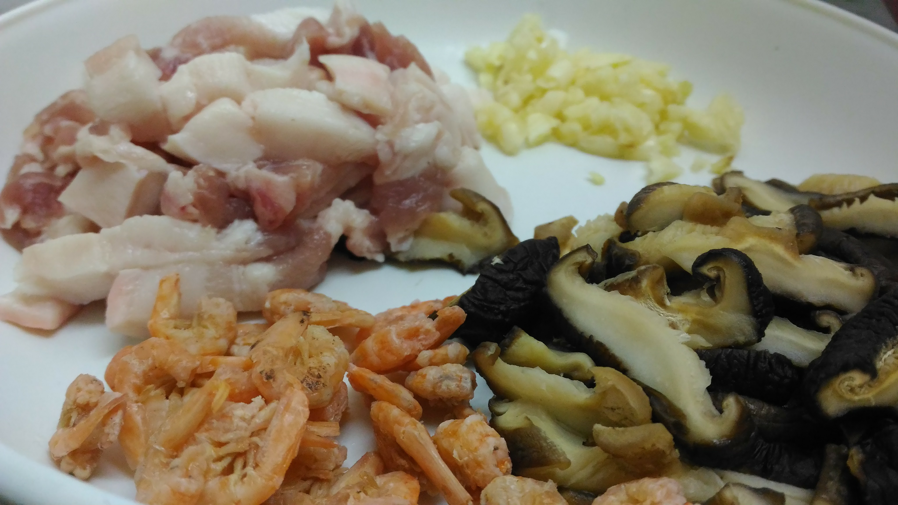
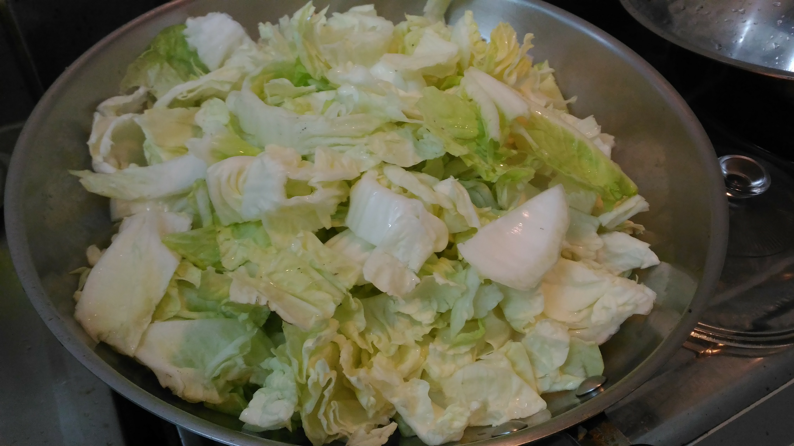
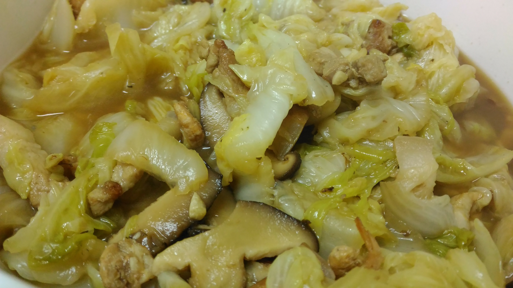

# 白菜滷

## 備料

 * 大白菜 x 1 顆 ➡ 切片
 * 金勾蝦 (蝦米) x 30 隻 ➡ 用溫水泡 20 ~ 30 分鐘後瀝乾
 * 五花肉 x 少許 ➡ 切絲
 * 香菇 x 5 朵 ➡ 切絲
 * 蒜頭 x 5 粒 ➡ 切成蒜末
 * 木耳 ➡ 切絲
 * 醬油 x 1 大匙
 * 水 x 600 cc

> <i class="fa fa-lightbulb-o fa-3x"></i>
> 如果平日比較沒時間的話，建議一次加 2 顆大白菜，煮一煮真的沒多少。

## 步驟

 * 用中小火逼出五花肉的油，再加入蝦米、蒜末爆香，最後再加入香茹絲 (水份較多)。
 * 加入白菜、水悶煮 30 分鐘，過程中定時翻攪，避免燒乾。
 * 起鍋前加入醬油上色，若不夠鹹則加點鹽。

## 參考資料

 * [白菜滷食譜→懷念古傳統的媽媽味\-怎麼煮才好吃，獨家小秘訣告訴你\!\! @ 雙胞胎♥ I'm紜琪媽咪玩編髮 :: 痞客邦 PIXNET ::](http://misslee0511.pixnet.net/blog/post/28634844) (2014-12-22)
 * [開陽白菜 @ 維多利亞的廚房 :: 痞客邦 PIXNET ::](http://victoriatpe.pixnet.net/blog/post/155896193) (2009-04-18)

